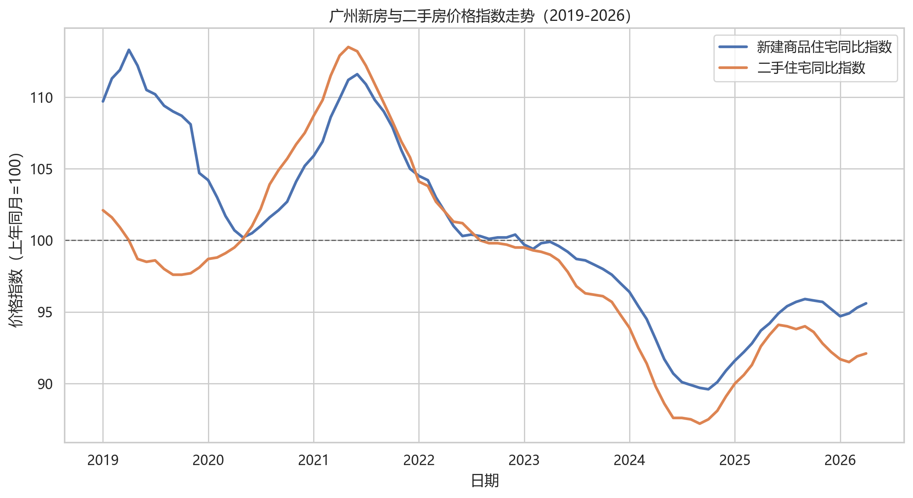
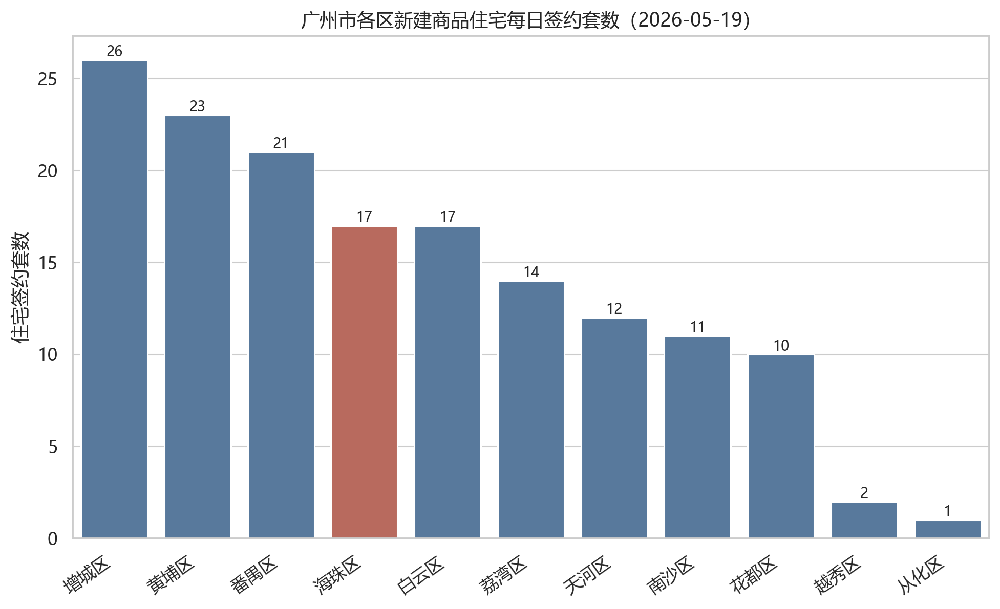
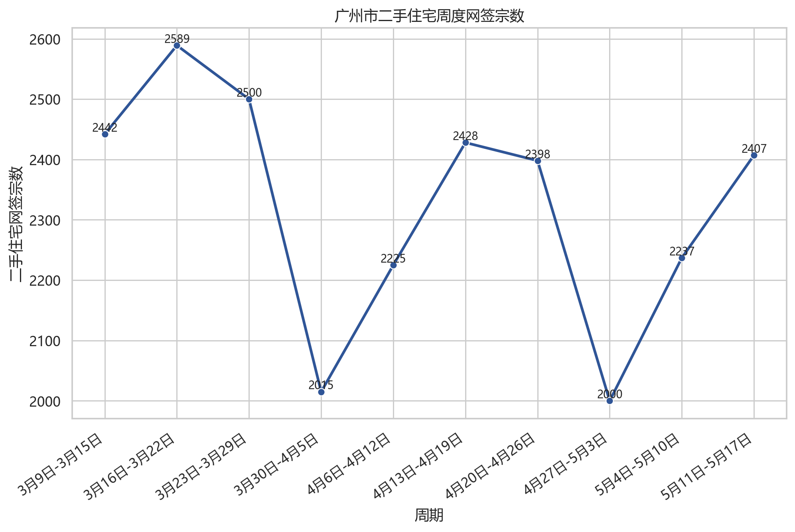
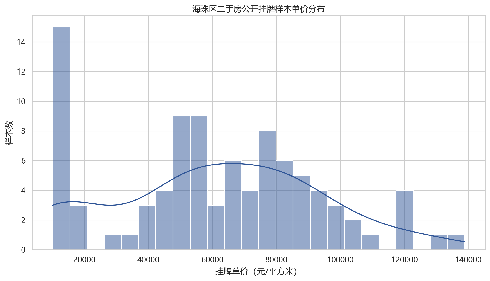
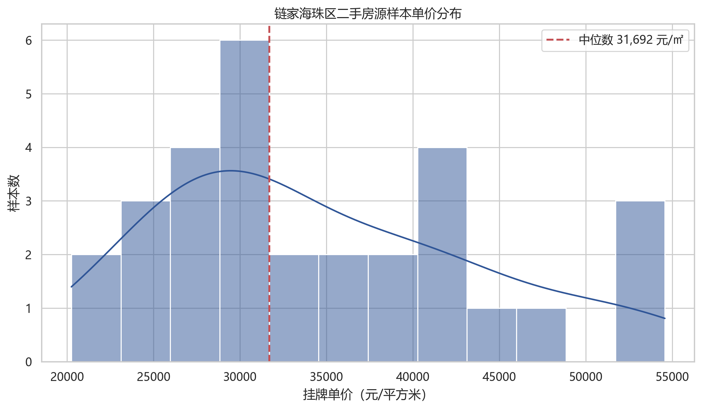
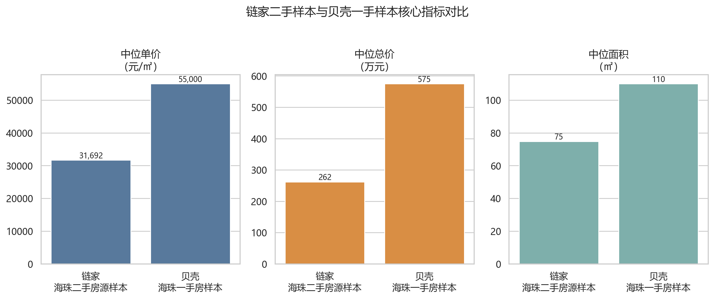
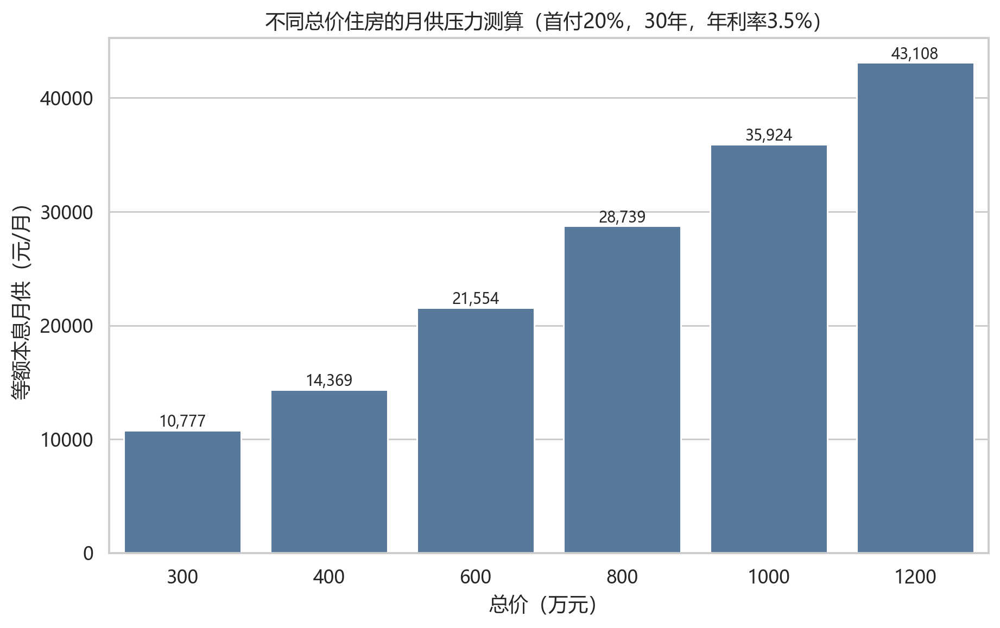
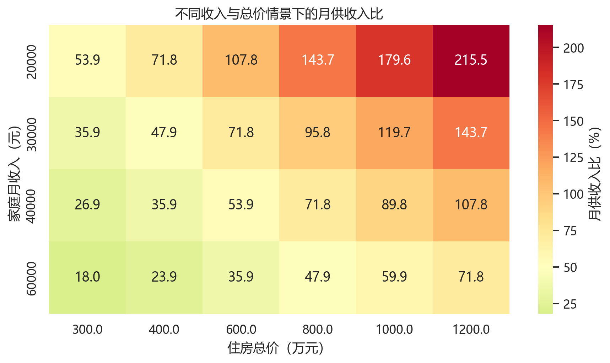

# 广州市海珠区未来房价走势与消费者购房时机判断

## 首页信息

| 项目 | 内容 |
|---|---|
| 课程 | 数据分析与经济决策（ds2026） |
| 作业 | Team02 小组作业 |
| 小组 | 第一组（G01） |
| 主题 | 广州市海珠区未来房价走向，消费者今年购房是否合时？ |
| 决策主体 | 计划在广州市海珠区购房的自住型刚需与改善型消费者 |
| 日期 | 2026-05-20 |

## 摘要

本报告面向计划在广州市海珠区购房的消费者，围绕“2026 年是否适合在海珠区买房”这一决策问题展开。报告将从房地产政策环境、广州及海珠区市场热度、价格指数走势、典型楼盘事件和居民支付能力五个角度进行分析。初步判断是：海珠区优质新盘热度明显上升，但这并不等同于全区房价普涨；对自住需求明确、现金流稳定、能承受利率和资产流动性风险的消费者，今年可以重点关注核心地段和价格合理项目；对投资型或预算紧张型购房者，应保持谨慎。

## 1. 研究背景

近年来，房地产行业仍是中国宏观经济的重要组成部分，房地产开发投资、商品房销售、居民按揭贷款和地方土地财政都与宏观经济运行密切相关。为了稳定房地产市场，国家和地方陆续出台降低首付比例、降低房贷利率、优化限购、支持“以旧换新”等政策。

广州作为一线城市，房地产市场具有明显分化特征。海珠区位于广州中心城区，具备琶洲数字经济集聚区、珠江沿岸景观资源、老城生活配套和地铁通勤优势，因此在改善型需求中具有较强吸引力。2026 年 5 月，海珠区保利海韵项目出现开盘热销，也进一步提升了市场关注度。

## 1.1 政策时间线

广州近期政策总体方向是降低购房门槛、支持改善置换、稳定市场预期。对消费者而言，政策利好主要体现在购房资格、首付比例、公积金额度和“卖旧买新”补贴等方面；但政策只能降低交易成本，不能消除房价波动和流动性风险。

## 2. 决策主体与核心问题

本报告的决策主体是计划在广州市海珠区购房的普通消费者，尤其是以下两类：

1. 刚需自住者：关注通勤、居住稳定性、教育和生活配套。
2. 改善型购房者：关注居住品质、资产置换、板块成长性和未来流动性。

核心问题包括：

- 当前政策是否明显降低购房成本？
- 广州房价指数是否出现企稳或反弹？
- 海珠区楼盘热销是否具有普遍代表性？
- 消费者今年买房、观望或暂缓的条件分别是什么？

## 3. 数据来源与获取方案

本报告采用三层数据证据：

第一，宏观与城市层面数据。使用国家统计局及 AkShare 获取全国房地产景气指标、广州新建商品住宅和二手住宅价格指数，并与北京、上海、深圳进行比较。

第二，广州和海珠区成交数据。使用广州市住建局“商品房销售统计信息”公开接口，整理 2026 年 5 月 19 日广州各区新建商品住宅可售、未售和签约数据；使用广州市房地产中介协会“一周独家数据”栏目，整理近 10 周广州市二手住宅网签宗数及海珠区相关文字说明。

第三，微观样本和案例。对链家、贝壳、58 同城、安居客、房天下等平台公开页面进行合规访问尝试；链家、贝壳、58 同城和安居客因登录、验证码或短壳页面未继续自动化采集，房天下公开列表可解析，整理 120 条海珠区挂牌样本；同时爬取主流新闻网站中关于保利海韵开盘热销的报道。

第四，用户补充平台样本。将小组补充的链家海珠二手房源 CSV 和贝壳海珠一手房 CSV 纳入项目，分别清洗出 30 条二手房挂牌样本和 31 条一手房项目/户型样本，用于与房天下样本、官方成交热度数据进行交叉说明。

## 4. 数据获取可行性说明

### 4.1 AkShare

AkShare 可用于复现宏观和城市层面数据：

- `macro_china_new_house_price()`：获取广州等城市新建商品住宅和二手住宅价格指数。
- `macro_china_real_estate()`：获取国房景气指数。

局限性是：AkShare 数据主要到城市层面，不能精确到海珠区，也不能直接反映单个楼盘成交情况。

### 4.2 链家和贝壳

链家/贝壳适合作为海珠区二手房挂牌样本和一手项目样本补充。本项目没有绕过平台登录、验证码或访问限制，而是采用用户补充 CSV 作为微观样本。报告中明确说明：挂牌价和平台参考价代表卖方报价、项目报价或平台展示信息，不等于真实成交价。

### 4.3 官方本地数据

广州本地数据应作为主证据，包括：

- 阳光家缘：一手住宅项目、网签和楼盘信息。
- 广州市房地产中介协会：二手住宅市场月度运行情况。
- 广州市住建局：政策文件和市场监管信息。

## 5. 指标设计

| 指标 | 含义 | 数据来源 |
|---|---|---|
| 新建商品住宅价格指数同比/环比 | 广州新房价格变化 | 国家统计局/AkShare |
| 二手住宅价格指数同比/环比 | 广州二手房价格变化 | 国家统计局/AkShare |
| 国房景气指数 | 全国房地产市场景气度 | AkShare |
| 海珠区挂牌单价 | 海珠二手房卖方报价 | 链家/房天下挂牌样本 |
| 海珠区一手项目参考价 | 海珠新房项目报价和总价带 | 贝壳一手房样本 |
| 开盘去化率 | 新盘热度 | 楼盘公开报道/阳光家缘 |
| 月供收入比 | 消费者支付压力 | 自行测算 |

## 6. 图表结果

1. 广州新房与二手房价格指数走势。
2. 广州与北上深房价指数对比。
3. 国房景气指数走势。
4. 广州住建局日度商品房销售数据。
5. 广州市房地产中介协会二手住宅周度网签数据。
6. 保利海韵主流新闻报道事实整理。
7. 海珠区公开挂牌样本单价分布。
8. 用户补充链家/贝壳样本一二手价格对比。
9. 不同总价情景下首付和月供压力测算。

### 6.1 广州新房与二手房价格指数走势

这张图用于判断广州整体房价是否已经企稳。若新房指数先于二手房指数改善，说明政策和新盘供给对市场预期有一定支撑；若二手房指数仍低于 100，则代表存量房市场仍有调整压力。

### 6.2 一线城市二手住宅价格指数对比

这张图用于判断广州在一线城市中的相对位置。如果广州二手房指数修复慢于北京、上海或深圳，说明广州市场仍偏弱；如果广州环比或同比改善更明显，则可作为市场情绪回升的证据之一。

### 6.3 国房景气指数

国房景气指数反映全国房地产行业景气程度。若指数仍处于低位，说明海珠区热盘热销更多体现为核心资产和优质项目的结构性机会，而不是全国房地产市场已经全面反转。

### 6.4 广州住建局日度商品房销售数据

本项目从广州市住建局“商品房销售统计信息”页面的公开接口获取每日数据。该页面说明数据为纳入网上签约管理范围的数据，用于观察广州各区新建商品房可售、未售与签约情况。

截至 2026 年 5 月 19 日，海珠区新建商品住宅当日签约 17 套、签约面积 1748.05 平方米；可售住宅 3553 套、未售住宅 5470 套。和增城、黄埔、番禺等区相比，海珠区当日签约规模处于中上位置，但仍不能仅凭单日数据判断持续性回暖。

### 6.5 广州市房地产中介协会二手住宅周度网签数据

本项目从广州市房地产中介协会“一周独家数据”栏目抓取近 10 周二手住宅网签数据。该栏目为周度市场观察，能够弥补官方日度新房数据无法反映二手住宅市场的问题。

数据显示，2026 年 3 月中旬以来广州市二手住宅周度网签大多维持在 2000 宗以上；其中 5 月 11 日-5 月 17 日，全市二手住宅网签 2407 宗，协会正文提到“番禺区和海珠区的网签超过300宗”。这说明海珠区在二手住宅市场中同样具有一定成交活跃度，但周度波动仍较明显。

### 6.6 保利海韵案例：热销是结构性信号

本项目爬取并整理新浪财经、财联社/界面新闻、新快报、证券时报/证券日报、东方财富等公开报道。可验证信息显示，保利海韵位于海珠区南泰路/海珠西片区，2026 年 5 月 10 日首推约 300 套以上房源，多家媒体报道其短时间售罄，认购金额约 18 亿至 18.2 亿元，部分报道提到认筹超过 700 组。

这说明广州核心区改善需求仍然存在，优质新盘在政策支持和价格预期变化下能够快速去化。但保利海韵属于区位、价格、产品和营销叠加的个案，其热销更适合作为“优质项目结构性走强”的证据，而不是“海珠区全域房价全面上涨”的证据。

### 6.7 海珠区二手房公开挂牌样本

本项目尝试访问链家、贝壳、58 同城、安居客和房天下等公开页面。链家返回登录页，贝壳返回 CAPTCHA 页面，58 同城和安居客返回验证码或壳页面，因此没有继续自动化采集。房天下海珠区公开列表页可解析，本项目低频采集前 2 页共 120 条挂牌样本。

需要注意的是，该样本是公开挂牌价，不是网签成交价；样本中也包含公寓、别墅和非标准住宅产品，因此只能作为市场报价和板块分化的辅助证据。

### 6.8 用户补充链家/贝壳样本

小组补充的链家海珠二手房源 CSV 包含 30 条样本，字段包括房源 ID、小区/楼盘、挂牌总价、单价、建筑面积、户型、朝向、楼层、装修、建成年份和挂牌时间等。清洗结果显示，该样本的二手挂牌中位单价约 31692 元/平方米，中位总价约 262 万元，中位面积约 74.83 平方米。

小组补充的贝壳海珠一手房 CSV 包含 31 条样本，字段包括楼盘、楼盘参考均价、总价参考、本套建筑面积、户型、朝向、地址和项目特色等。清洗结果显示，该样本的一手项目中位参考单价约 55000 元/平方米，中位参考总价约 575 万元，中位面积约 110 平方米。

从样本对比看，一手项目的单价、总价和面积中位数均高于二手挂牌样本，说明海珠区消费者若选择新房改善项目，需要面对更高的总价门槛；若预算较紧，二手市场仍可能提供更低总价带的选择。但两份样本规模有限，且分别代表平台挂牌价和平台参考价，因此更适合作为价格结构和购房门槛的辅助证据。

### 6.9 购房支付能力测算

本报告采用等额本息、贷款 30 年、基准年利率 3.5% 的简化假设，测算不同总价住宅的月供压力。该测算不构成银行审批结果，仅用于消费者决策比较。

在首付 20%、年利率 3.5% 情景下，400 万总价住宅对应月供约 1.44 万元；600 万总价住宅月供约 2.16 万元。若家庭月收入为 3 万元，400 万住宅月供收入比约 47.9%，600 万住宅约 71.8%，已经进入较高压力区间。因此，“是否合时”不仅取决于房价走势，也取决于家庭现金流和风险承受能力。

## 7. 决策建议

| 消费者类型 | 今年购房判断 | 理由 |
|---|---|---|
| 刚需自住、预算稳定 | 可以积极看房、择优买入 | 政策降低成本，核心区优质项目稀缺，自住需求不宜过度择时 |
| 改善置换、旧房可较快出售 | 可以谨慎推进 | 改善项目选择增加，但需控制旧房出售周期和资金链 |
| 投资型购房 | 不建议作为主策略 | 房价弹性和租金回报不确定，流动性风险较高 |
| 预算紧张、收入不稳定 | 建议暂缓 | 高总价区域月供压力大，需保留现金流安全边际 |

综合政策、价格指数、挂牌样本和支付能力测算，本报告建议把结论表述为“结构性适合买入”而不是“全面适合买入”。海珠区核心板块和优质新盘具备稀缺性，但挂牌样本显示板块之间分化明显，且宏观房地产景气尚未全面恢复。消费者应以自住需求和现金流安全为主线，而不是根据单个热盘事件追涨。

## 8. 局限性

1. 海珠区微观成交价数据公开程度有限，贝壳/链家挂牌价和平台参考价不能直接代表成交价。
2. 单个热销楼盘可能受到地段、价格、产品和营销影响，不能简单外推到全区。
3. 房价走势受政策、利率、收入预期、土地供应和人口流动影响，预测具有不确定性。

## 9. 参考资料

- 广州市住房和城乡建设局：商品房销售统计信息，https://zfcj.gz.gov.cn/zfcj/tjxx/spfxstjxx/index.html
- 广州市住房和城乡建设局：存量房交易登记统计信息，https://zfcj.gz.gov.cn/xysj/fwxx/clfjydjtjxx/index.html
- 广州市房地产中介协会：一周独家数据，https://www.gzrea.org.cn/website/website_scyj_scyjList.action?pdid=205
- 广州市人民政府：广州市进一步促进房地产市场平稳健康发展通知，https://www.gz.gov.cn/zwgk/fggw/sfbgtwj/content/mpost_9674048.html
- 广州市人民政府：广州住房公积金贷款额度说明，https://www.gz.gov.cn/zt/shb/content/mpost_10129232.html
- AkShare 宏观数据文档，https://akshare.akfamily.xyz/data/macro/macro.html
- 新浪财经/乐居财经：90秒售罄！保利海韵开盘“日光”，销售额18亿元，https://finance.sina.com.cn/stock/estate/zc/2026-05-10/doc-inhxmeai7686815.shtml
- 新浪财经/财经网：广州新政后首个“日光盘”诞生——保利海韵售罄，https://finance.sina.com.cn/roll/2026-05-11/doc-inhxnwmm1954255.shtml
- 财联社/界面新闻：广州楼市诞生新政后首个“日光盘”，300套房源两分半钟全部售罄，https://www.cls.cn/detail/2368514
- 新快报：穗八条后广州首现“日光”盘！保利海韵300余套房两分钟售罄，https://xxsb.gz-cmc.com/pages/2026/05/10/9316ee36c2ab4a1a9648ea36537b43c9.html
- 房天下广州海珠二手房公开列表，https://gz.esf.fang.com/house-a074/
- 用户补充链家海珠二手房源 CSV：`data/raw/lianjia_haizhu_secondhand_user.csv`
- 用户补充贝壳海珠一手房 CSV：`data/raw/beike_haizhu_newhome_user.csv`
