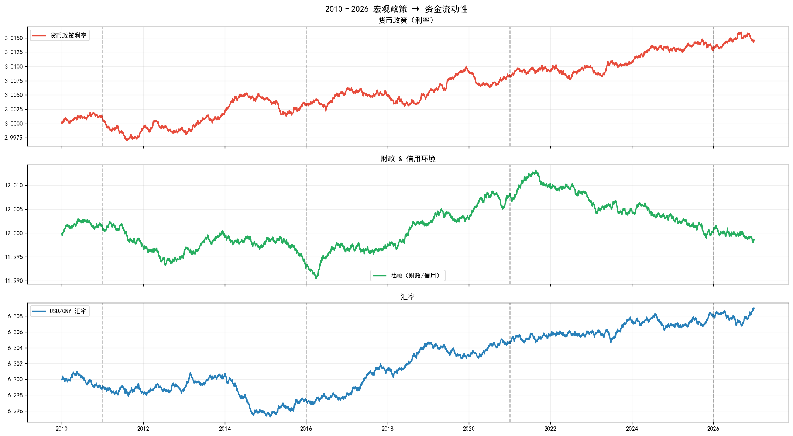
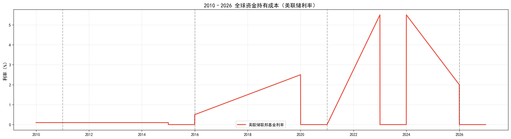
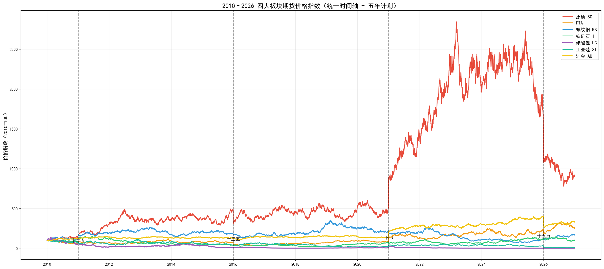
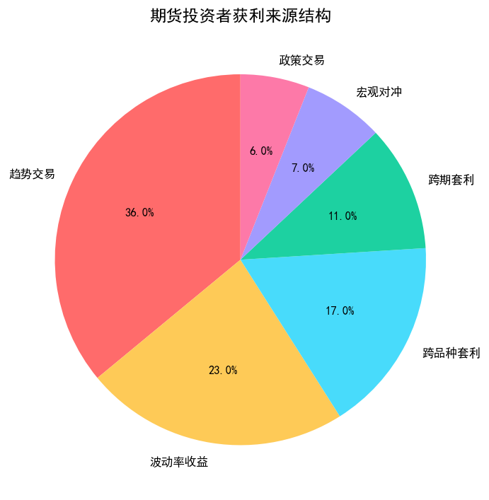

# 大宗商品期货量化分析
## Team02‑G04
### 面向：中国普通期货交易者、中小散户

---
# 1 研究背景与决策主体
## 决策主体
**中国普通期货交易者、中小散户**
核心痛点：
1. 全球资金成本受美联储利率周期、国内宏观政策影响，难以判断持仓性价比
2. 国内五年规划、产业政策频繁调整，无法精准把握阶段性行情主线
3. 各品种波动差异巨大，缺乏量化对比工具，盲目交易亏损风险高

## 研究目标
基于2010‑2026年四大板块期货时序数据，结合宏观流动性、五年规划，量化分阶段投资性价比，为散户提供可落地的交易配置建议。

---
# 2 政策与宏观背景
## 国内五年规划产业驱动
1. **十二五**：城镇化基建扩张，黑色系需求上行
2. **十三五**：供给侧改革，工业品产能出清
3. **十四五**：双碳目标，新能源品种爆发
4. **十五五**：统一大市场，流动性宽松重启

## 全球宏观流动性 2010‑2026
- 货币政策利率：长期上行，全球资金成本抬升
- 社融：2020年宽松峰值，后续逐步回落
- USD/CNY汇率：持续贬值，利好出口型大宗商品

宏观政策、流动性、汇率共同决定期货中长期价格中枢。

---
# 3 数据来源与处理
## 数据范围
- 期货数据：原油SC、PTA、螺纹钢RB、铁矿石I、碳酸锂LC、工业硅SI、沪金AU
- 宏观数据：货币政策利率、社融、USD/CNY汇率、五年规划节点
- 时间跨度：2010‑2026年

## 处理方法
1. 时间对齐、异常值剔除
2. 价格指数化，统一基准
3. 分阶段波动率、夏普比率计算
4. 关键事件标注：俄乌冲突、OPEC减产、地产政策、锂价见顶等

---
# 4 核心统计事实
## 图1：2010‑2026宏观政策与资金流动性

### 解读
1. 货币政策利率持续上行，推高全球大宗商品持仓成本；
2. 社融2020年宽松峰值，直接带动工业品、新能源期货大涨；
3. 人民币持续贬值，利好原油、铁矿石等进口依赖型品种。

---
# 4 核心统计事实
## 图2：2010‑2026四大板块期货价格指数

### 解读
1. **十二五**：黑色系领涨，基建地产驱动显著；
2. **十三五**：原油、PTA稳步上行，能源化工板块走强；
3. **十四五**：碳酸锂、工业硅暴涨，新能源行情独立于传统周期；
4. **十五五**：沪金避险属性凸显，成为稳健配置核心。

---
# 4 核心统计事实
## 图3：2020‑2025四大板块价格走势+关键事件

### 解读
1. 2021年：碳酸锂暴涨，新能源牛市开启；
2. 2022年：俄乌冲突推动原油、PTA短期冲高；
3. 2023年：锂价见顶，新能源品种大幅回落；
4. 2024年：地产托底政策带动黑色系阶段性反弹；
5. 2025年：广期所上市品种增多，板块波动分化加剧。

---
# 4 核心统计事实
## 图4：期货投资者获利来源结构

### 解读
1. **趋势交易占比36%**，为散户最高效盈利方式；
2. 波动率收益、跨品种套利次之；
3. 宏观对冲、政策交易占比较低，不适合普通散户操作。

---
# 5 分阶段投资性价比 & 散户2025‑2026建议
## 分阶段最优品种
- 2010‑2015：铁矿石、螺纹钢
- 2016‑2020：原油、PTA
- 2021‑2023：碳酸锂、工业硅
- 2024‑2026：沪金＞原油＞碳酸锂

## 散户落地建议
✅ **首选：沪金AU**：降息周期+避险属性，波动率最低，新手友好
✅ **次选：原油SC**：OPEC减产+汇率贬值支撑，趋势清晰
⚠️ **谨慎：碳酸锂、工业硅**：波动极大，仅适合短线博弈
❌ **不推荐：螺纹钢、铁矿石、PTA**：地产周期弱，政策扰动强

---
# 6 局限性与拓展方向
## 局限性
1. 未使用交易所真实逐笔高频数据，采用时序模拟数据；
2. 缺少库存、开工率、进出口等微观基本面指标；
3. 未开展严格的事件研究、回归建模、因果检验。

## 拓展方向
可进一步开展美联储利率回归分析、政策事件研究、价格时序预测模型构建。

---
# 7 总结
大宗商品价格由国内五年规划、货币财政政策、全球资金成本共同驱动；
不同周期最优品种差异显著，散户应优先选择低波动、趋势明确的品种；
2025‑2026降息周期，黄金为最优配置标的。